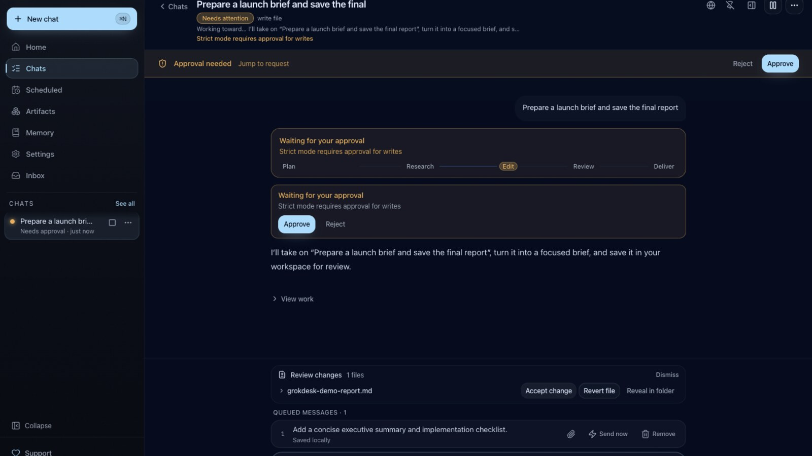
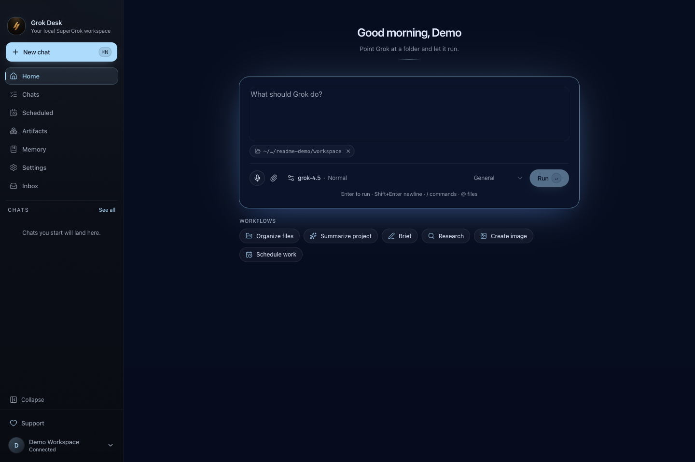
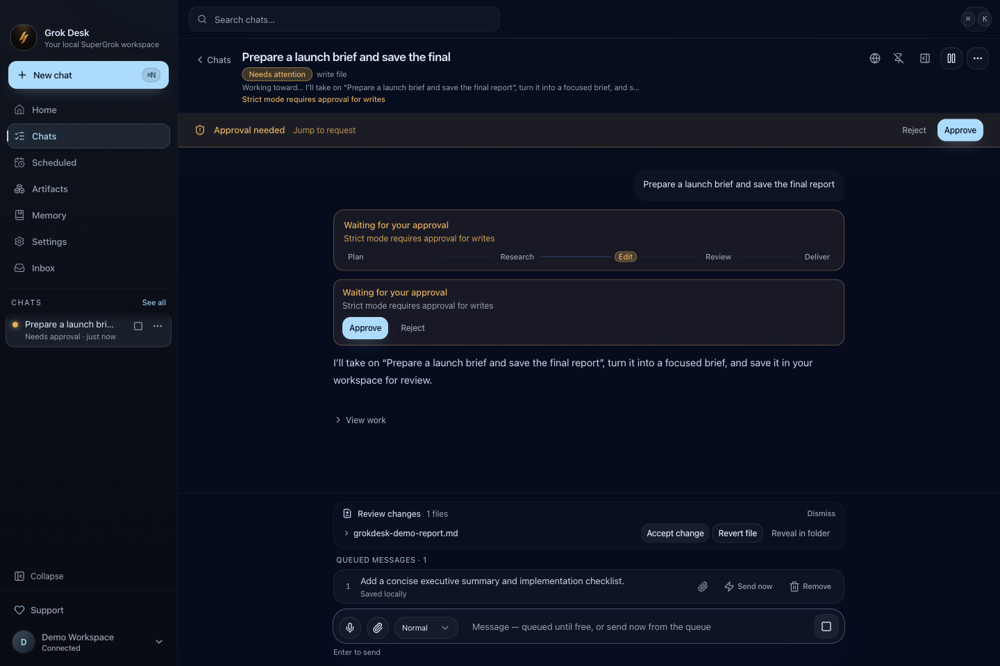
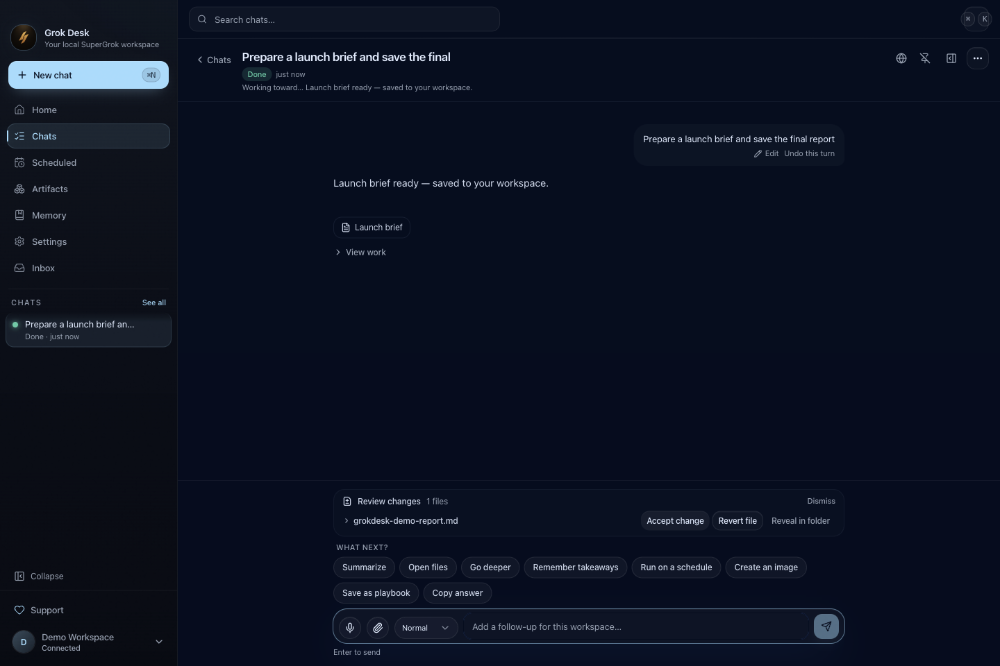
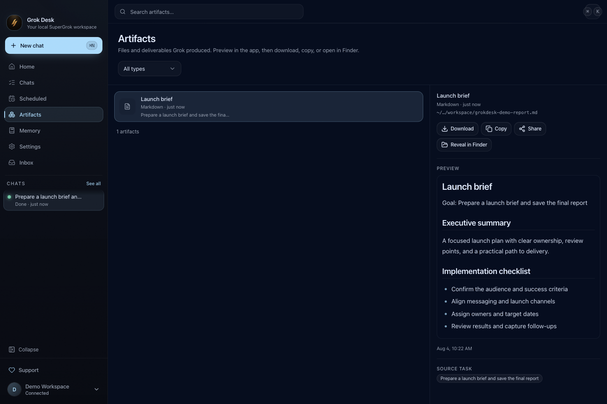
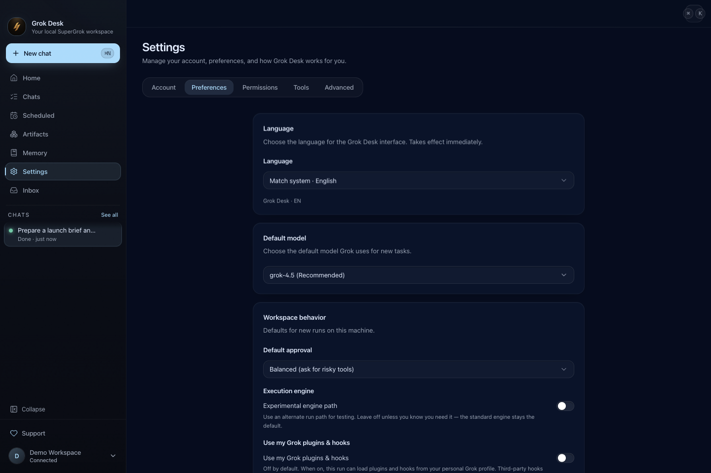

<p align="center">
  
</p>

<h1 align="center">Grok Desk</h1>

<p align="center">
  <strong>Give Grok a goal. Get finished work back on your machine.</strong>
</p>

<p align="center">
  A desktop workspace for SuperGrok with durable conversations, parallel work,<br />
  browser tools, schedules, memory, approvals, and files you can actually use.
</p>

<p align="center">
  <a href="https://github.com/blockvantage/grok-desktop/releases/latest"></a>
  <a href="https://grokdesk.app"></a>
  <a href="https://grokdesk.app/support"></a>
</p>

<p align="center">
  
</p>

## Work that leaves the chat

Grok Desk turns SuperGrok into a local desktop coworker. Describe the outcome, choose where it may work, and keep moving while Grok researches, browses, writes, and assembles deliverables. Results land in a workspace you control and in an Artifacts view built for opening, copying, downloading, and sharing.

It is designed for long-running work, not optimistic chat bubbles. Messages have visible delivery states, accepted work survives restarts, follow-ups queue durably, and an approval never masquerades as progress.

| | |
| --- | --- |
| **Platforms** | macOS 12+ (Apple Silicon and Intel) · Windows 10/11 x64 |
| **Account** | SuperGrok for full model runs; the interface can be explored signed out |
| **Workspaces** | Local folders selected by you, with Strict, Balanced, or Autopilot policy |
| **Source** | Electron + React desktop, local TypeScript gateway, SQLite durability |

## See the current product

### Start with an outcome

The Home composer keeps model, effort, role, attachments, and workspace context together. Drafts restore after restart, and onboarding lets you revisit any setup choice before launch.

<p align="center">
  
</p>

### Keep moving while Grok works

Different conversations can run in parallel. Follow-ups inside one conversation stay ordered; queue them for later or use **Send now** to interject into the active run without creating a competing task.

<p align="center">
  
</p>

### Approvals that stay readable

Strict and Balanced modes pause risky actions with a clear description of what, where, and why. Approval surfaces enter once and stay visually stable—no perpetual blinking. Autopilot is available for folders you fully trust and can allow deletes without prompting.

<p align="center">
  
</p>

### Review the result, then use the file

Completed turns keep their answer, work history, deliverables, review actions, and suggested next steps together. File changes are filename-first, with Accept, Revert, and Reveal actions.

<p align="center">
  
</p>

| Deliverables with real previews | Trust controls you can change anytime |
| :---: | :---: |
|  |  |

## Delivery you can trust

The chat path is intentionally conservative about what it claims:

- **Durable follow-up outbox.** A local SQLite queue drains FIFO and reports capacity errors instead of dropping messages.
- **Exactly-once root submission.** Stable client mutation IDs and pending-create reconciliation prevent duplicate tasks during retry and resync.
- **One active run per conversation.** A conversation stays causally ordered while other conversations can continue in parallel.
- **Honest Send now.** It interjects into the current run; it never falls back to a concurrent task creation.
- **Truthful state.** “Working” appears after acceptance, stale event history is disclosed, and retry/recovery remains visible.
- **Recoverable drafts.** Goal, workspace, and attachments hydrate before the composer becomes submit-ready.

## More than a chat window

- Per-task browser cockpit with origin and submit protections
- Local Artifacts library with previews and source-task links
- Schedules with cron, timezone, and quiet-hour controls
- Local memory, standing instructions, and reviewable takeaways
- Role packs for Marketing, Research, Ops, Chief of Staff, or general work
- MCP connectors and project skills
- Command palette, keyboard shortcuts, notifications, and multi-language UI
- Local audit trail for tool requests, decisions, recovery, and task state

Memory and preferences are stored locally; relevant context is sent to SuperGrok when a run needs it. Product credentials use the repository’s AES-256-GCM file vault under Electron `userData` with a local key file—never OS Keychain, Windows Credential Manager, `keytar`, or Electron `safeStorage`.

## Download

| Platform | Installer |
| --- | --- |
| macOS · Apple Silicon | [GrokDesk-mac-arm64.dmg](https://github.com/blockvantage/grok-desktop/releases/latest/download/GrokDesk-mac-arm64.dmg) |
| macOS · Intel | [GrokDesk-mac-x64.dmg](https://github.com/blockvantage/grok-desktop/releases/latest/download/GrokDesk-mac-x64.dmg) |
| Windows · x64 | [GrokDesk-win-x64.exe](https://github.com/blockvantage/grok-desktop/releases/latest/download/GrokDesk-win-x64.exe) |
| Verification | [SHA256SUMS.txt](https://github.com/blockvantage/grok-desktop/releases/latest/download/SHA256SUMS.txt) |

The release notes state the signing/notarization status for each build. Unsigned macOS or Windows installers may trigger Gatekeeper or SmartScreen; verify the published SHA-256 checksum before opening them.

## Three steps to a deliverable

1. Sign in with SuperGrok, choose a local folder, and select an approval mode.
2. Describe the outcome. Keep the conversation open or work in another chat while it runs.
3. Approve sensitive actions when asked, then open the finished file from the conversation or Artifacts.

## For builders

Prerequisites: Node.js 20.x, pnpm 9.x, and the platform toolchain described in the packaging guides.

```bash
pnpm install
pnpm build
pnpm dev

# Release gates
pnpm typecheck
pnpm test
pnpm --filter @grokdesk/desktop release-qa
pnpm --filter @grokdesk/desktop bundle-budget
pnpm --filter @grokdesk/desktop e2e:chat
```

| Area | Path |
| --- | --- |
| Electron desktop and renderer | [`apps/desktop`](apps/desktop) |
| Local gateway and orchestration | [`packages/gateway`](packages/gateway) |
| Provider runtime and adapters | [`packages/agent-runtime`](packages/agent-runtime), [`packages/provider-grok`](packages/provider-grok) |
| Shared protocol and contracts | [`packages/shared`](packages/shared) |
| Design system | [`apps/desktop/DESIGN.md`](apps/desktop/DESIGN.md) |
| macOS packaging | [`docs/packaging-macos.md`](docs/packaging-macos.md) |
| Windows packaging | [`docs/packaging-windows.md`](docs/packaging-windows.md) |
| Credential decision | [`docs/decisions/2026-07-24-no-keychain.md`](docs/decisions/2026-07-24-no-keychain.md) |

The deterministic README capture uses a disposable profile under ignored `samples/readme-demo/`, the fake E2E provider, public product IPC, and no real account, workspace, or credential data:

```bash
pnpm --filter @grokdesk/desktop capture:readme
```

## Support

| Need | Where |
| --- | --- |
| Product and downloads | [grokdesk.app](https://grokdesk.app) |
| Product support | [grokdesk.app/support](https://grokdesk.app/support) |
| Feature feedback | [grokdesk.app/feedback](https://grokdesk.app/feedback) |
| Repository issues | [GitHub Issues](https://github.com/blockvantage/grok-desktop/issues) |

<p align="center">
  <sub>© 2026 Grok Desk · SuperGrok and Grok are products of xAI and are sold separately.</sub>
</p>
